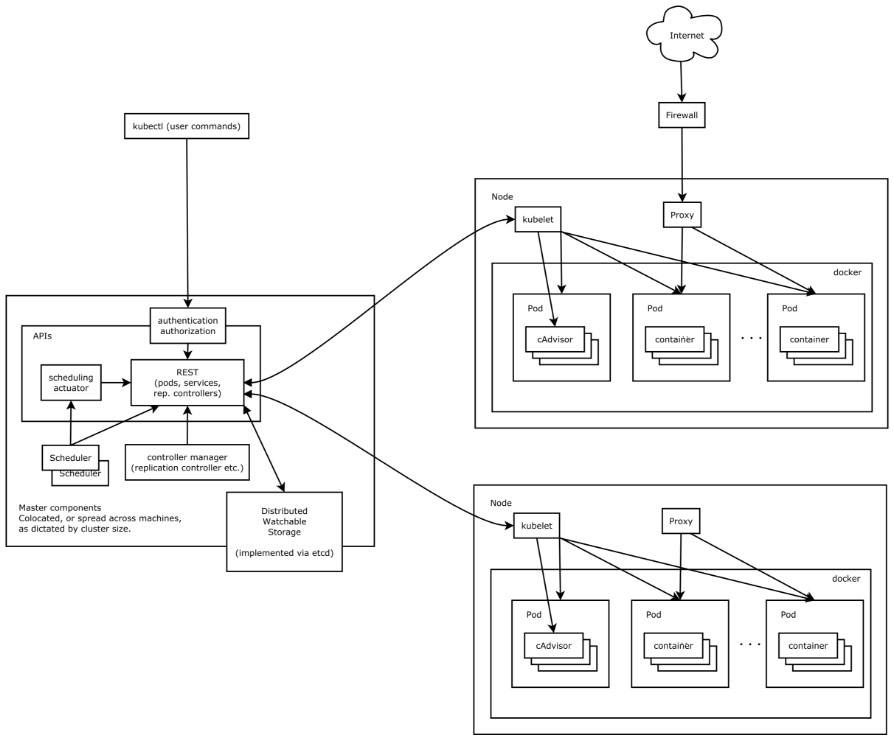
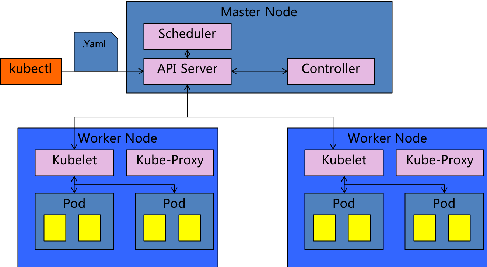

## K8s

<!-- vim-markdown-toc GFM -->

* [1 Kubernetes 概述](#1-kubernetes-概述)
    * [1.1 简介](#11-简介)
    * [1.2 特性](#12-特性)
* [2 Kubernetes 设计架构](#2-kubernetes-设计架构)
    * [2.1 官网体验教程](#21-官网体验教程)
* [3 重要概念](#3-重要概念)
* [4 使用 yaml 文件来部署应用实践](#4-使用-yaml-文件来部署应用实践)
    * [4.1 扩容及缩容](#41-扩容及缩容)
        * [创建 namespace](#创建-namespace)
        * [创建应用](#创建应用)
        * [扩容](#扩容)
        * [创建 service 及访问 service](#创建-service-及访问-service)

<!-- vim-markdown-toc -->
## 1 Kubernetes 概述

### 1.1 简介
Kubernetes 是一个开源的，用于管理云平台中多个主机上的容器化的应用，Kubernetes 的目标是让部署容器化的应用简单并且高效（powerful）,Kubernetes 提供了应用部署，规划，更新，维护的一种机制。

### 1.2 特性

> * 服务发现和负载均衡
> * 自我修复 - 重新启动失败的容器
> * 横向缩放 - 使用简单的命令或 UI，或者根据 CPU 的使用情况自动调整应用程序副本数
> * 自动部署和回滚
> * 密钥和配置管理 - 部署和更新密钥和应用程序配置，不会重新编译镜像，不会暴露
> * 更多

## 2 Kubernetes 设计架构

Kubernetes 集群包含有节点代理 kubelet 和 Master 组件 (APIs, scheduler, etc)，一切都基于分布式的存储系统。下面这张图是 Kubernetes 的架构图。



k8s 全景简图



### 2.1 官网体验教程

https://kubernetes.io/docs/tutorials/kubernetes-basics/

官网通过如下 6 部分来实践如何玩转 k8s

> * 创建 k8s 集群
> * 部署应用
> * 内部访问应用
> * 外部访问应用
> * Scale 应用
> * 滚动更新

## 3 重要概念

> * Cluster : 计算，存储和网络资源的集合，K8s 利用这些资源运行各种基于容器的应用
>   * 比如在百度 CCE 上首先需要创建个集群（购买 N 台 BCC 实例时，实际后台是创建了 N+3 实例，其中 3 台用于创建 Master 节点）
> * Master : 主要负责调度，决定应用放在哪里运行
> * Node ：Node 的职责是运行容器应用。
>   * Node 由 Master 管理，Node 负责监控并汇报容器的状态
>   * 根据 Master 的要求管理容器的生命周期
> * Pod ：K8s 的最小工作单元。每个 Pod 包含一个或者多个容器。
>   * Pod 中的容器会作为一个整体被 Master 调度到一个 Node 上运行
> * Controller : K8s 通过 Controller 来管理 Pod，Controller 定义了 Pod 的部署特性：
>   * Deployment: 记录版本更新信息，通过控制 replicaset，完成版本更新，回滚等操作
>   * ReplicaSet: 控制 pods 数量
>   * DaemonSet
>   * StatefuleSet
>   * Job
> * Service：定义了外界访问一组 Pod 的方式
>   * ClusterIP
>   * NodePort
>   * LoadBalancer
> * Namespace
>   * 多个用于或者项目可以使用同一个 cluster , 然后使用不同的 Namespace
>   * --namespace=name 名

## 4 使用 yaml 文件来部署应用实践

### 4.1 扩容及缩容

#### 创建 namespace

> kubectl create -f namespace.yaml

namespace.yaml:
```
apiVersion: v1
kind: Namespace
metadata:
  name: meetbill
```
> kubectl get deployments --namespace=meetbill

空的

#### 创建应用

> kubectl create -f mypython.yaml

mypython.yaml:
```
apiVersion: extensions/v1beta1
kind: Deployment
metadata:
  name: mypython-deployment
  namespace: meetbill
spec:
  replicas: 3
  template:
    metadata:
      labels:
        app: mypython
        track: stable
        version: 1.0.0
    spec:
      containers:
        - name: mypython
          image: "hub.baidubce.com/xxxx/mypython:1.0.0"
          ports:
            - name: http
              containerPort: 8080
```
> kubectl get pods --namespace=meetbill 能看到实例是3

```
NAME                                  READY     STATUS    RESTARTS   AGE
mypython-deployment-b5f8f646d-b2dzs   1/1       Running   0          23s
mypython-deployment-b5f8f646d-f7vwz   1/1       Running   0          23s
mypython-deployment-b5f8f646d-vnqqm   1/1       Running   0          23s
```

#### 扩容

> $kubectl scale deployments/mynode-deployment --replicas=4 --namespace=meetbill
> $kubectl get pods  --namespace=meetbill 能看到实例已经变为4个

#### 创建 service 及访问 service

> kubectl create -f mypython-svc.yaml 

mypython-svc.yaml:
```
apiVersion: v1
kind: Service
metadata:
  name: mypython-svc
  namespace: meetbill
  labels:
    app: mypython
spec:
  ports:
  - port: 8080
    targetPort: 8080
  type: NodePort
  selector:
    app: mypython
```

> export NODE_PORT=$(kubectl get services/mypython-svc -o go-template='{{(index .spec.ports 0).nodePort}}' --namespace=meetbill)

获得NODE_PORT
 
> $while (true); do curl http://$VM_IP:$NODE_PORT; sleep 1;done

重复的刷，能看到是多个实例的返回
