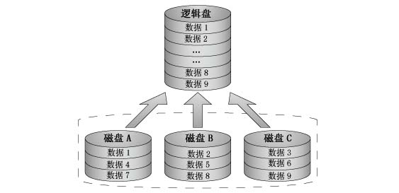

# 什么是RAID

* [RAID 动画演示](#raid-动画演示)
* [RAID分类](#raid分类)
	* [RAID 0(striped)](#raid-0striped)
	* [RAID 1(mirroring)](#raid-1mirroring)
	* [RAID5 (分布式奇偶校验的独立磁盘结构](#raid5-分布式奇偶校验的独立磁盘结构)
	* [RAID0+1/1+0](#raid0110)
* [查看raid信息(硬件raid)](#查看raid信息硬件raid)

RAID, Redundant Arrays of Inexpensive Disks,容错式廉价磁盘阵列.RAID 的基本原理是把多个便宜的小磁盘组合到一起，成为一个磁盘组，使性能达到或超过一个容量巨大、价格昂贵的磁盘。目前 RAID技术大致分为两种：基于硬件的RAID技术和基于软件的RAID技术。其中在Linux下通过自带的软件就能实现RAID功能，这样便可省去购买昂贵的硬件 RAID 控制器和附件就能极大地增强磁盘的 IO 性能和可靠性。由于是用软件去实现的RAID功能，所以它配置灵活、管理方便。同时使用软件RAID，还可以实现将几个物理磁盘合并成一个更大的虚拟设备，从而达到性能改进和数据冗余的目的。当然基于硬件的RAID解决方案比基于软件RAID技术在使用性能和服务性能上稍胜一筹，具体表现在检测和修复多位错误的能力、错误磁盘自动检测和阵列重建等方面。

# RAID 动画演示

[RAID 动画演示下载](https://raw.githubusercontent.com/BillWang139967/op_practice_code/master/store/RAID/raid.exe)

# RAID分类

常用的 RAID RAID0/RAID1/RAID5/RAID10

| 级别   |     有点      |     缺点|
|------------|----------|---------|
|RAID 0 | 存取速度最快 | 没有容错 |
|RAID 1 | 完全容错 | 成本高 |
|RAID 5 | 多任务可容错 | 写入时有overhead |
|RAID 0+1/RAID 10 | 速度快,完全容错, 成本高 |

## RAID 0(striped)

Striped模式,把连续的数据分散懂啊多个磁盘上存取.速度快,但是没有冗余.

## RAID 1(mirroring)

RAID 1可以用于两个或2xN个磁盘，并使用0块或更多的备用磁盘，每次写数据时会同时写入镜像盘。这种阵列可靠性很高，但其有效容量减小到总容量的一半，同时这些磁盘的大小应该相等，否则总容量只具有最小磁盘的大小。

## RAID5 (分布式奇偶校验的独立磁盘结构

## RAID0+1/1+0

raid0 over raid1 

# 查看raid信息(硬件raid)

    dmesg | grep -i raid

