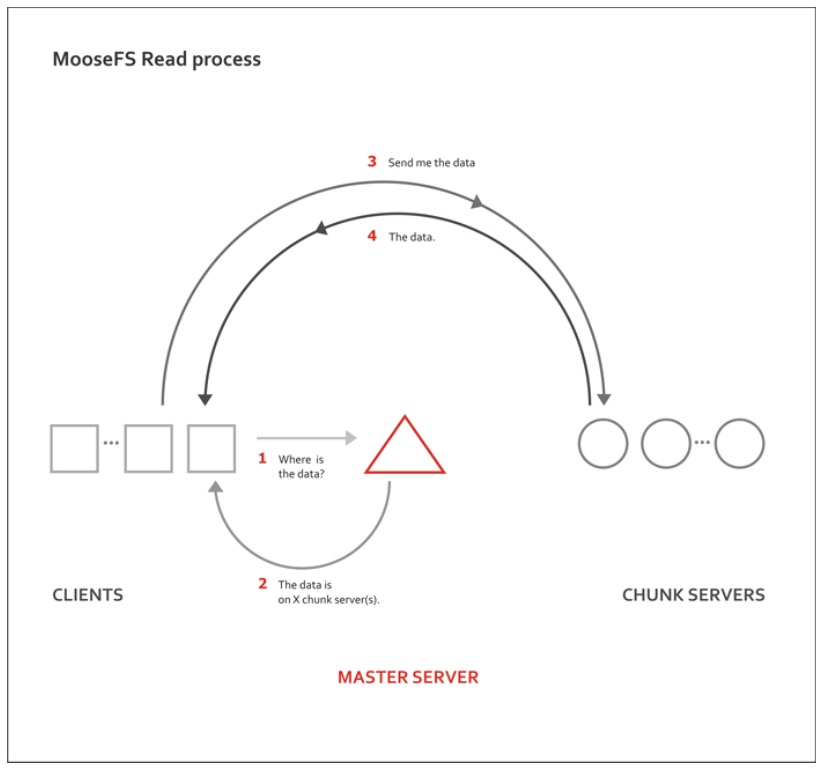

## MooseFS

本文介绍 `MooseFS` 架构原理，安装配置和使用方法。

`MooseFS` 是一种容错的分布式文件系统。它将数据分散到多个物理位置（服务器），在用户看来是一个统一的资源。
`MooseFS` 支持 `FUSE` 标准接口，能够无缝实现从本地文件的迁移。
同时，`MooseFS` 提供比 `NFS` 更好的可运维性。

<!--excerpt-->

### 功能特性

对于标准的文件操作，`MooseFS` 表现与其它类 Unix 文件系统一致。

支持的通用文件系统特性有：

* 层次结构（目录数），是一种操作友好的文件系统。
* 兼容 POSIX 文件属性
* 支持特殊文件（块设备与字符设备，管道和套接字）
* 符号链接（软链接）和硬链接。
* 基于 IP 地址和（或）密码的访问权限控制

`MooseFS` 独特的特性有：

* 高可靠性（数据的多个副本存储在多个不同服务器上）
* 容量动态扩展。只要增加新的机器／磁盘
* 删除的文件保留一段时间（可配），像是文件系统的回收站。
* 即使文件在被读写，也可以持续做文件快照。

------

### 架构原理

MooseFS 包含 4 个组件

* 管理节点 master servers。支持单活。存储所有文件的元数据
* 数据节点 chunk servers 数量不限。存储文件数据，相互同步文件。
* 元数据备份服务器 metalogger server。数量不限。保存元数据变更日志，周期性的下载元数据文件。主节点失效时可以替代主节点。
* 客户端。挂载使用文件系统。

文件的读写流程可以根据以下图示来理解：

#### 关于分片

文件数据分片（chunks）后保存，分片默认最大值为 64MiB。分片对应 chunkserver 中的文件。
分片数据是版本化的，如果文件执行更新后，某台机器还有旧版本的数据，则会删除该机器上的旧版本文件，并同步到改文件的最新版本。

#### 容错／高可靠

将文件分发多份到多个服务器中存储，以实现高可靠。通过设置单个文件的 `goal` 来指定文件应该可以保留的副本数。
重要数据建议将 goal 设置大于2；而将 goal 设为 1，则文件只在1台数据节点上保存

------

### 安装配置

#### 配置要求

**管理节点** 是系统的核心，需要使用稳定性高的硬件设备，如冗余电源，ECC 内存，RAID1/RAID5/RAID10。
根据文件数量的不同，也需要配置比较多的内存（一般来说，100 万个文件对应 300MiB 内存）。
硬盘容量需要考虑文件数量和文件操作数量（一般来说，20GiB 磁盘可以保存2500万文件的元数据，或者 50 小时的文件操作日志）。
管理节点如此重要，也需要根据情况做好安全设置。

**元数据备份服务器** 只需要和管理节点有同样多的内存和磁盘来存储数据即可。

**数据节点** 只需要保持足够的磁盘容量。

#### 安装过程

在 CentOS 系统上安装。

首先配置使用软件仓库。

将 moosefs 仓库到 GPG KEY 加入本地软件包管理工具。

    curl "http://ppa.moosefs.com/RPM-GPG-KEY-MooseFS" -o /etc/pki/rpm-gpg/RPM-GPG-KEY-MooseFS

增加MooseFS3.0仓库配置项。

    curl "http://ppa.moosefs.com/MooseFS-3-el$(grep -o '[0-9]*' /etc/centos-release |head -1).repo" -o /etc/yum.repos.d/MooseFS.repo

使用以下命令来安装软件包：

    # For Master Server:
    yum install moosefs-master moosefs-cli moosefs-cgi moosefs-cgiserv

    # For Chunkservers:
    yum install moosefs-chunkserver

    # For Metaloggers:
    yum install moosefs-metalogger

    # For Clients:
    yum install moosefs-client

启动文件系统

    # To start process manually:
    mfsmaster start
    mfschunkserver start
    # For sysv os family - EL5, EL6:
    service moosefs-master start
    service moosefs-chunkserver start
    # For systemd os family - EL7:
    systemctl start moosefs-master.service
    systemctl start moosefs-chunkserver.service

系统参数

    # for master server
    sysctl vm.overcommit_memory=1

------

### 使用方法

#### 挂载

    $ sudo mfsmount -H <mfs-master> [-P 9421] [-S /] [-o rw|ro] /mnt/mfs

其中，
`-H` / `-P` 代表 mfsmaster 的 IP 和端口；
`-S` 挂载 MooseFS 中的路径；
`-o rw` 或 `-o ro` 设置读写或只读模式；
`/mnt/mfs` 为本地挂载路径。

#### 设置冗余度

通过配置冗余度来保证出现失效时不丢失数据。
冗余度为 N 时，能够在不超过 N-1 个 chunkserver 同时出现失效时不丢失数据。

默认我们设置文件的冗余度为 2，即支持有 1 个 chunkserver 失败时不影响使用。

调整数据冗余度(goal)

    $ sudo mfssetgoal -r 2 /mnt/mfs

其中，
`-r` 选项代表递归目录及子目录的文件。

可以通过 `mfsgetgoal` 来读取当前的冗余度

    $ sudo mfsgetgoal /mnt/mfs
    /mnt/mfs 2

可以通过 `mfscheckfile` 来读取特定文件的冗余度设置与生效情况

    $ sudo mfscheckfile /mnt/mfs/testfile
    /mnt/mfs/testfile:
    2 copies: 1 chunks

建议：

*  最低设置为 2，保证不出现文件丢失；
*  一般情况下设置为 3，应该是足够安全的；
*  对于足够重要的数据，可以设置为 4 或者更高，但是不能超过 chunkserver 实例数量。

#### 设置 Trash time

文件删除后会在 moosefs 的垃圾站中保留一段时间。
通过 `mfsgettrashtime` 能读取过期时间的设置。

#### 使用快照

使用 MooseFS 的一个好处是可以支持文件或目录的快照。
我们知道 MooseFS 的分块都是版本化的，因此支持快照的方式保留一个文件的副本。
在文件被修改前，这个副本并不会占用额外的空间。

#### 启动顺序与停止顺序

启动顺序

*  启动 mfsmaster
*  启动 mfschunkserver
*  启动 mfsmetalogger
*  在 client 节点执行 mfsmount

停止顺序

*  在所有 client 节点执行 umount
*  mfschunkserver stop
*  mfsmetalogger stop
*  mfsmaster stop

#### 数据恢复

当出现 master 节点出现问题时，可以通过 `mfsmetarestore` 来恢复元数据。

    mfsmetarestore -a -d /storage/mfsmaster

如果 master 节点故障严重无法启动，可以利用 metalogger 节点的元数据备份来恢复。
首先在选定的节点上按照 mfsmaster，使用之前 master 节点的相同配置；
从备份设备或 metalogger 拷贝 `metadata.mfs.back` 文件到新 master 节点；
从 metalogger 拷贝失败前元数据最新的 changelog 文件（`changelog.*.mfs`）；
执行 `mfsmetarestore -a`。

#### Automated Failover

生产环境使用 MooseFS 时，需要保证 master 节点的高可用。
使用 `ucarp` 是一种比较成熟的方案。

`ucarp` 类似于 `keepalived`，通过主备服务器间的健康检查来发现集群状态，并执行相应操作。

------

### 总结

使用 `MooseFS` 为应用提供了更高的可用性，为运维提供了很好的操作便利。
